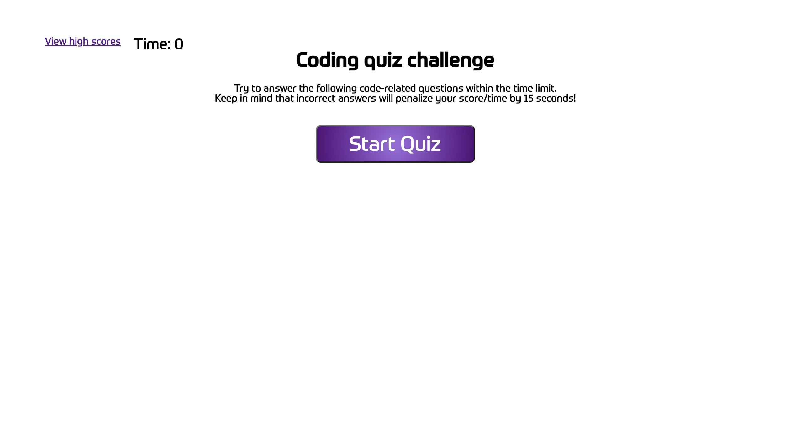

# javascript-coding-quiz
Coding Boot Camp week 04 challenge

This application is a quiz with coding based mulitiple choice questions. The quiz has a timer which begins counting down from 60 seconds once the start quiz button is clicked. The user is presented with 5 consecutive questions with multiple choice answers. If the user answers a question incorrectly 15 seconds is deducted from the timer as a penalty. The time remaining (if any) at the end of the quiz is the user's score. The user can save their initials and final score at the end of the quiz, this data is then stored in local storage. The user is able to click a link to view high scores which redirects them to another HTML page which shows a list of previous scores.

This challenge used many concepts learned in the previous week including referencing elements from the DOM, DOM traversal, DOM manipulation, event listeners, for loop and else if statements. 

